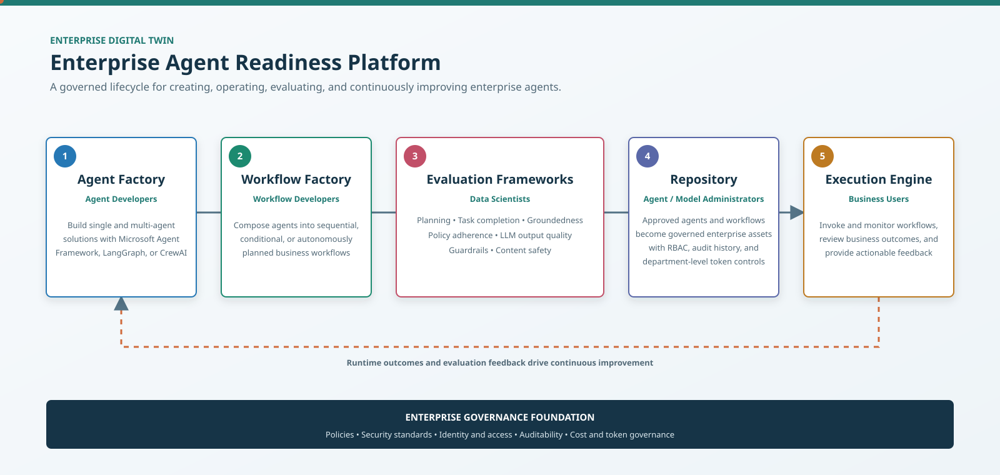

# Projects

## Enterprise Digital Twin

Large Language Model (LLM) agents are emerging as a new engine for enterprise automation. Organizations are developing agents with varying degrees of autonomy, but disconnected initiatives can duplicate effort, fragment capabilities, and introduce security, privacy, and operational risks.

The **Enterprise Digital Twin (EDT)** provides a governed harness for creating, training, evaluating, and improving enterprise agents autonomously before production deployment.

### Key Principles

1. **Unified agent development:** Establishes a shared enterprise foundation that reduces fragmented implementations and duplication across teams.
2. **Governed autonomy:** Applies clear guardrails to help prevent data leakage, unauthorized actions, and other operational mishaps as agents gain autonomy.
3. **Autonomous learning sandbox:** Gives agents a safe, representative environment in which to learn and improve autonomously through reinforcement learning without putting production systems at risk.
4. **Goal-seeking agent creation:** Enables agents to be created and optimized autonomously around defined business goals while remaining grounded in enterprise policies, security standards, and operating principles.
5. **Task-aware evaluation:** Evaluates how effectively an agent completes the task at hand, including its decisions, actions, policy compliance, and business outcomes, rather than judging only the LLM's final response.

> **Status:** Prototype under active development.

---

## Agent Workflow Enterprise Pattern

The **Agent Workflow Enterprise Pattern** provides a standardized, governed lifecycle for building agents, composing them into business workflows, evaluating their readiness, and deploying them as reusable enterprise assets.

### Key Capabilities

1. **Agent Factory:** Enables agent developers to build single-agent and multi-agent solutions using frameworks such as Microsoft Agent Framework, LangGraph, and CrewAI.
2. **Workflow Factory:** Allows workflow developers to compose agents into sequential, conditional, or autonomously planned workflows that deliver business outcomes.
3. **Evaluation Frameworks:** Measures planning efficiency, task completion, groundedness, policy adherence, LLM output quality, guardrail compliance, and content safety before deployment.
4. **Governed Repository:** Stores approved agents and workflows as enterprise assets with role-based access control, audit history, and token governance.
5. **Execution Engine:** Enables business users to invoke and monitor workflows, review outcomes, and provide feedback for continuous improvement.

> **Status:** Enterprise pattern under active development.

[Back to profile](README.md)
